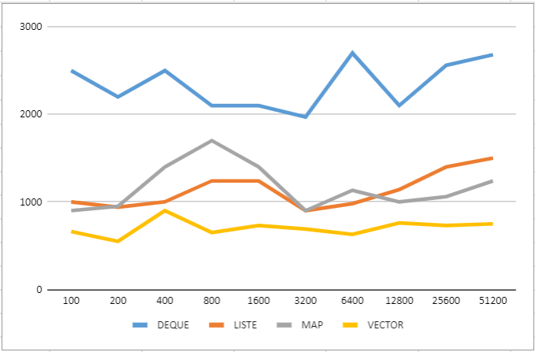

this is the code for a document based  search engine written in C++ the architecture takes multiple types of indexes for comparison reasons.
## Comparison

Here is a comparison image that highlights the differences in response time based on index type:

